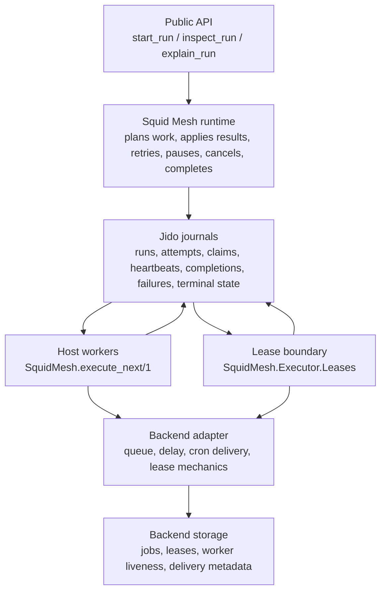

# Architecture

Squid Mesh is a workflow automation platform for Elixir applications. It runs
inside a host application's supervision tree and infrastructure.

## Core Components

`SquidMesh.Workflow`

- declarative DSL for triggers, payload, steps, transitions, and retries

`SquidMesh`

- public runtime API for starting, inspecting, listing, cancelling, and replaying runs

`SquidMesh.Runtime.WorkflowAgent`

- rebuilds per-run workflow coordination state from durable run-thread journal
  entries and checkpoints, including planned runnables, applied results,
  manual pause or approval state, and terminal status

`SquidMesh.Runtime.DispatchAgent`

- rebuilds per-queue dispatch state from durable dispatch-thread journal
  entries and checkpoints, including visible attempts, running leases, retries,
  completed results, failures, and expired claims

`SquidMesh.Runtime.DispatchProtocol`

- defines append-only run, dispatch, and run-index journal entries for the
  journal-backed runtime; its claim and heartbeat vocabulary is compatible
  with lease-capable backend adapters and refers only to durable dispatch
  fencing metadata, not host-backend worker lifecycle management

`SquidMesh.Runtime.Journal`

- persists dispatch protocol entries and projection checkpoints through
  `Jido.Storage`, preserving Jido thread revision pointers for rebuildable
  runtime projections

`SquidMesh.Runtime.Journal.Storage`

- normalizes the trusted host-configured storage adapter for journal threads
  and checkpoints; the built-in production relational path is the
  Postgres-compatible Ecto adapter, while other adapters must provide the same
  ordering, conflict-detection, checkpoint, and rebuild guarantees

`SquidMesh.Runtime.RunIndexProjection`

- rebuilds workflow-scoped run lookup state from run-index journal entries,
  keeping duplicate index facts idempotent and surfacing malformed or
  conflicting index facts as anomalies

`SquidMesh.Runtime.RunCatalogProjection`

- rebuilds global run lookup state from run-catalog journal entries, so
  host-facing tools can list all journal-backed runs without adapter-specific
  storage scans

`SquidMesh.ReadModel.Inspection`

- rebuilds workflow and dispatch agent projections into a read-only inspection
  snapshot for the journal-backed runtime, including pending dispatches,
  unapplied results, scheduled attempts, visible attempts, expired claims,
  manual intervention state, terminal state, and projection anomalies

`SquidMesh.ReadModel.Explanation`

- turns a projection-backed inspection snapshot into a deterministic operator
  explanation with reason-specific details, suggested runtime next actions, and
  evidence pointers back to durable journal revisions

`SquidMesh.inspect_run/2` and `SquidMesh.explain_run/2`

- use the journal read model as the default public behavior and infer Ecto
  storage from the configured repo
- still accept explicit projection options such as `journal_storage:` or
  `queue:` when callers need to inspect or explain a non-default journal
  boundary

`SquidMesh.Executor`

- optional host-implemented behaviour for enqueueing cron activations when an
  external scheduler wants to deliver `SquidMesh.Executor.Payload.cron/3`
  payloads through a job backend

`SquidMesh.Runtime.Runner`

- backend-neutral entrypoint that host jobs call when queued cron payloads are
  delivered

`SquidMesh.Runtime.RetryPolicy`

- resolves step-level retry policy into retry decisions and backoff delays

`SquidMesh.Tools`

- shared boundary for external adapters such as HTTP

## Runtime Responsibilities

Squid Mesh owns:

- workflow structure
- payload validation
- durable run, dispatch, step, attempt, and manual-control facts
- replay and cancellation semantics
- retry policy at the workflow-step layer
- projection-backed inspection and explanation

Jido owns:

- step behavior execution
- action contracts inside custom step modules
- the storage behaviour used by the Jido-native journal and checkpoint boundary

Postgres owns:

- source-of-truth persistence for journal threads, entries, checkpoints, and
  host application data when using the default Ecto storage adapter

## Execution Flow

1. A host application starts a run through `SquidMesh.start/2`, `start/3`, or `start/4`.
2. Squid Mesh validates the workflow definition and payload.
3. The journal runtime appends run and runnable facts to the host repo through
   the configured journal storage adapter.
4. A worker calls `SquidMesh.execute_next/1` to claim one visible attempt.
5. Step output is appended back to the journal and projected into run state.
6. The runtime decides whether the run completes, advances, retries, fails, or
   no-ops.
7. If more work is required, successor runnable intent is appended before later
   workers can claim it.

Delivered cron payloads use `SquidMesh.Runtime.Runner.perform/2` to start runs
through the configured journal runtime. Step execution is claimed through
`SquidMesh.execute_next/1`.

## Recovery Boundary

Squid Mesh records claim, lease, and result facts in the Jido-native dispatch
protocol for replay and recovery. A host can run a simple supervised worker that
calls `SquidMesh.execute_next/1`; lease-capable backends can additionally expose
backend-owned worker fencing through `SquidMesh.Executor.Leases`.

Current guarantees:

- run, step, attempt, manual-control, and dispatch history is durable
- queued and scheduled workflow intent survives deploys and restarts through the journal
- stale or duplicate deliveries are treated as workflow-level no-ops when possible

Current non-goals:

- replacing every backend-specific worker heartbeat or lease manager
- automatic reclamation of a step that died mid-side-effect
- exactly-once external side effects without idempotent step implementations

## Recommended Reading

- [Positioning](positioning.md)
- [Workflow authoring guide](workflow_authoring.md)
- [Jido runtime architecture](jido_runtime_architecture.md)
- [Storage strategy](storage_strategy.md)
- [Durable dispatch protocol](durable_dispatch_protocol.md)
- [Host app integration](host_app_integration.md)
- [Tool adapters](tool_adapters.md)
- [Observability](observability.md)
