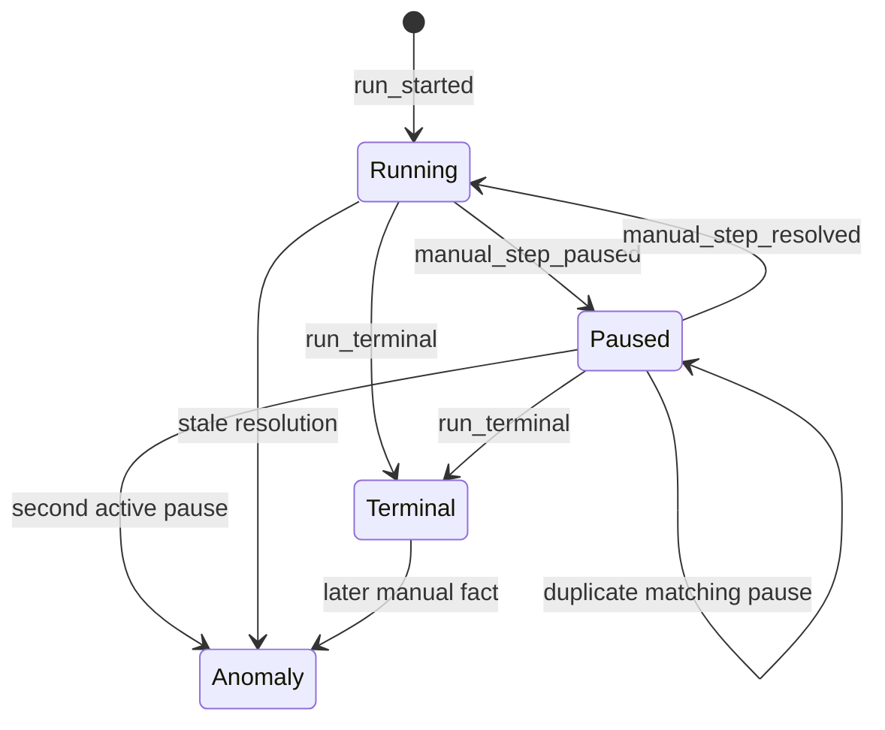

# Durable Dispatch Protocol

Squid Mesh's new runtime path treats dispatch state as an append-only journal.
The protocol and pure projection are storage-independent, and
`SquidMesh.Runtime.Journal` persists the same entries through
`SquidMesh.Runtime.Journal.Storage`, which currently delegates to `Jido.Storage`
thread journals and checkpoints.

## Threads

- Run thread: workflow lifecycle facts such as run start, planned runnables,
  applied runnable results, manual pause/resolution boundaries, and terminal
  status.
- Dispatch thread: runnable intent, claim, heartbeat, completion, failure, retry
  visibility, and live wakeup facts.
- Run index thread: rebuildable lookup entries for finding runs by workflow or
  host-facing keys.

`SquidMesh.Runtime.Journal` maps those logical threads to Jido thread IDs such
as `squid_mesh:run:<run-id>`, `squid_mesh:dispatch:<queue>`, and
`squid_mesh:run_index:<workflow>`. Runtime entries keep the Squid Mesh protocol
type as the Jido entry kind and store the protocol data as the entry payload, so
projections can be rebuilt from the thread after process restart.

## Journal Storage Boundary

The journal boundary accepts any configured storage adapter through
`SquidMesh.Runtime.Journal.Storage`. Today that boundary delegates to
`Jido.Storage`, but Squid Mesh runtime modules depend on the Squid Mesh-owned
boundary so the core protocol can stay database-agnostic as the Jido-native
runtime evolves.

Adapters used behind the boundary must honor Jido's optimistic `:expected_rev`
option, return `{:error, :conflict}` for stale appends, and store projection
checkpoints with the exact thread revision they cover. Checkpoints are rebuild
accelerators; the append-only thread remains the source of truth.

The storage-backed slices prove the Squid Mesh protocol can persist and restore
dispatch projections through `Jido.Storage`. Host apps can now configure the
Jido-native runtime, projection read model, journal storage adapter, and queue at
the Squid Mesh boundary so start, execution, inspection, and manual controls use
the journal path without per-call runtime options.

## Journal Runtime Support

The journal runtime is built around append-only facts, rebuildable Jido agents,
and optional checkpoints:

- `SquidMesh.Runtime.WorkflowAgent` and `SquidMesh.Runtime.DispatchAgent` are
  `Jido.Agent` modules whose state can be rebuilt from journal entries.
- `SquidMesh.Runtime.Journal.Storage` is the Squid Mesh-owned boundary that
  validates storage config before delegating to a `Jido.Storage` adapter.
- Run threads record workflow lifecycle facts, planned runnables, applied
  runnables, manual pauses or resolutions, and terminal state.
- Dispatch threads record queue-visible facts, including scheduled attempts,
  claims, heartbeats, completions, failures, and wakeup emissions.
- Run-index threads keep workflow-scoped lookup projections rebuildable without
  scanning storage adapter internals. Index facts carry the dispatch queue used by
  the run.
- The global run-catalog thread keeps all-run listing rebuildable without
  scanning storage-adapter internals. Catalog facts carry the workflow and queue
  needed to rebuild redacted listing summaries from each run thread.
- Checkpoints store compact projections at a covered thread revision. They are
  rebuild accelerators; missing or stale checkpoints must not become the source
  of truth.

The Postgres-backed adapter,
`SquidMesh.Runtime.Journal.Storage.Ecto`, persists Jido thread entries and
checkpoints in Squid Mesh tables installed through the host migration. Appends
lock the thread row, honor Jido's `:expected_rev` option, and assign stable
per-thread sequence numbers before writing entries. The example host app smoke
path now exercises `Squid -> journal runtime -> Jido agents -> Ecto/Postgres`
and includes a checkpoint-loss recovery case that starts a journal run, deletes
run and dispatch checkpoints, then inspects and completes the run from persisted
thread entries.

Important edge cases are intentionally handled in the runtime protocol:

- stale claim completions and heartbeats are fenced by `claim_id` and
  `claim_token_hash`
- duplicate runnable scheduling is interpreted through runnable keys and
  idempotency keys
- concurrent appenders must use storage-level expected revisions or serialized
  appends
- corrupted persisted entry payloads are surfaced as invalid journal entries
  instead of being replayed silently
- terminal state is derived from the run thread, while dispatch projection state
  remains explainable from the queue thread

The current recovery smoke proves replay from persisted entries after checkpoint
loss. A literal mid-run VM or OS-process restart remains a stronger follow-up
for the switchover, especially once the journal runtime becomes the default.

For production adapters, the required storage properties are:

- ordered thread append with stable per-thread sequence numbers
- optimistic append conflict detection through `:expected_rev`
- checkpoint overwrite semantics for compact projections
- durable reload of thread entries and checkpoints after process restart
- trusted host-owned configuration; `journal_storage` should not be derived from
  request input

That makes the desired shape adapter-based, not tied to one database. It does
not mean every database is an equally good fit. A backend that cannot provide
atomic per-thread append, deterministic ordering, conflict detection, and
durable checkpoint reads would need extra coordination or should not be used as
a production journal backend. The recommended Postgres path is
`SquidMesh.Runtime.Journal.Storage.Ecto`, which satisfies the Jido storage
callbacks through the host repo and Squid Mesh journal tables. The Bedrock path
should use a Jido-compatible adapter where Bedrock is available. Squid Mesh
should not introduce a second persistence contract for those stores; adapters
only need to satisfy the journal storage boundary.

## Commit Order

Durable facts must be appended before live effects are treated as successful. A
worker wakeup is recoverable only when a matching runnable intent already exists
in the dispatch journal. If a wakeup is lost after the intent append, the
projection can still rediscover the visible attempt after restart. Duplicate
runnable intent entries are idempotent when their scheduled fields match;
conflicting entries for the same `runnable_key` are anomalies.

If a crash happens after the workflow run thread records planned runnables but
before the dispatch thread records matching `attempt_scheduled` entries, rebuilt
agents can recover through
`SquidMesh.Runtime.WorkflowAgent.schedule_pending_dispatches/4`. The workflow
agent derives planned-but-unscheduled runnables from the run projection, and the
dispatch agent appends the missing dispatch intents with its current dispatch
thread revision as the optimistic fence.

`SquidMesh.Runtime.AgentRecovery.recover/4` is the restart coordinator for the
current Jido-native agent slices. It rebuilds the run's workflow agent and the
queue's dispatch agent, schedules planned-but-missing dispatch intents first,
and only then applies completed dispatch results that are still missing from the
run thread.

For dependency-based workflows, Runic-ready runnables map to durable runnable
intent. Independent root steps may produce sibling runnable intents for the same
run, and a join step produces intent only after every dependency result has
already become durable. The dispatch protocol does not use host-job concurrency
as the source of truth for fan-out or fan-in readiness; persisted workflow facts
do.

## Backend Lease Alignment

Squid Mesh models workflow-specific facts, but its dispatch vocabulary is
designed to map to durable queue and lease backends:

- `attempt_scheduled` maps to an enqueued durable work item.
- `runnable_key` maps to a backend key, idempotency key, or lineage field.
- `step` and `input` map to work kind and payload.
- `claim_id`, `claim_token_hash`, `owner_id`, and `lease_until` mirror
  queue lease state.
- `attempt_heartbeat`, `attempt_completed`, and `attempt_failed` require the
  current claim fence.

Squid Mesh should integrate through backend adapters rather than make durable
queue systems depend on Squid-specific workflow concepts. The adapter can map
Squid runnables to backend work items and translate lifecycle signals back into
the projection. Bedrock is the recommended reference backend today because the
example app exercises durable queueing, delayed visibility, claims, heartbeats,
completion, retry, and dead-letter behavior. The Squid Mesh core protocol
remains backend-neutral so host applications can still provide another backend
with equivalent lease and recovery semantics.

## Job Runner Boundary

The protocol does not assume Oban, Broadway, Bedrock, or a custom process as
the delivery mechanism. A runner may wake, claim, execute, retry, or redeliver
work, but Squid Mesh treats the journal as authoritative for intent, claim,
lease, fencing, completion, failure, and retry visibility.

## Claims, Leases, And Heartbeats

Each attempt is fenced by `claim_id` and `claim_token_hash`. Workers hold the raw
claim token, but durable entries record only its hash. A heartbeat extends
`lease_until` only when it carries the current claim fence. Heartbeats from stale
claims are ignored by the projection and surfaced as anomalies. Expired claims
remain discoverable so a dispatch agent can redeliver work without relying on
in-memory state. A replacement claim is valid only after the prior lease has
expired; active claim takeover is an anomaly. Claims are valid only after the
attempt's `visible_at`, and heartbeat, completion, and failure facts are valid
only before the current lease expires.

`SquidMesh.Runtime.DispatchAgent.claim_next/4`,
`SquidMesh.Runtime.DispatchAgent.heartbeat/6`,
`SquidMesh.Runtime.DispatchAgent.complete/7`, and
`SquidMesh.Runtime.DispatchAgent.fail/7` are the current durable claim lifecycle
boundaries for the Jido-native runtime work. Claiming selects the next visible
or expired attempt from a rebuilt dispatch-agent projection and appends an
`attempt_claimed` entry with Jido's optimistic `:expected_rev` fence. Heartbeat,
completion, and failure appends validate the current claim fence before writing,
then append the matching lifecycle entry with the same optimistic thread fence.
On success, each API returns a lifecycle update map containing the updated
`:agent`, the lifecycle `:attempt`, and `:lease_until` for heartbeat calls. The
post-append projection is available at `agent.state.projection`; concurrent
stale callers receive `{:error, :conflict}` from the journal append.

Backend-owned lease integration remains dependency-free at the Squid Mesh core
layer. Bedrock is the recommended reference backend, but the protocol only
requires the lease, heartbeat, conflict, retry, and recovery semantics described
above.

## Completion And Retry

Completion and failure entries must also carry the current claim fence.
Duplicate completion entries with the same claim and result are idempotent.
Conflicting or stale completions are ignored and reported as anomalies. Retry
scheduling is a durable fact with its own `visible_at`, so retry visibility
survives restart. A runnable result can be applied to the run thread only after
the matching completion is durable. `SquidMesh.Runtime.WorkflowAgent.apply_result/4`
is the current run-thread apply boundary: it accepts a completed dispatch
attempt, validates that the runnable belongs to the rebuilt workflow projection,
and appends `:runnable_applied` with an optimistic run-thread fence. Duplicate
application of an already-applied runnable is idempotent.

`SquidMesh.Runtime.WorkflowAgent.apply_pending_results/4` is the restart
recovery boundary for lost live wakeups: rebuilt workflow and dispatch agents
derive completed-but-unapplied attempts from their durable projections and append
the missing run-thread applications in order, using the latest run-thread fence
after each append.

## Manual Boundaries

Manual pause and approval states are run-thread facts, not dispatch-thread
facts. `manual_step_paused` records the current manual boundary with its step,
kind, timestamp, and persisted metadata. `manual_step_resolved` records that the
same boundary was completed by an operator action such as resume, approve, or
reject.

The journal runtime appends `manual_step_paused` for built-in `:pause` and
`:approval` steps. `manual_step_resolved` is appended when `unblock_run/3`,
`approve_run/3`, or `reject_run/3` resolves that manual boundary with
`runtime: :journal`.

The workflow projection exposes only the current manual state. Duplicate pause
facts are idempotent when they match. A second active manual boundary, a stale
resolution, or a manual fact appended after the run is terminal becomes a
projection anomaly instead of changing the current state.

## Terminal Runs

A `run_terminal` entry fences remaining dispatch work for the run. Rebuilt
projections exclude terminal-run attempts from visible and expired-claim
redelivery views, clear current manual state, and surface later wakeup, claim,
completion, failure, apply, or manual entries for that run as anomalies.
