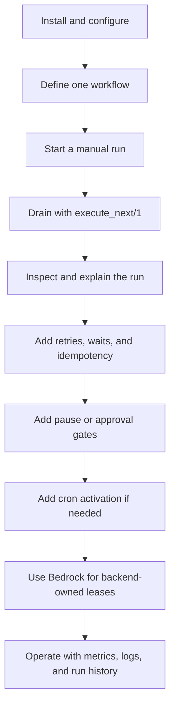

# Getting Started

This is the first guide for workflow authors and host-app maintainers. It starts
with the product model, then adds runtime, reliability, and operations concepts
only when they become useful.

## Mental Model

Squid Mesh has three boundaries:

1. **Workflow definition** - a compiled Elixir module that declares triggers,
   payload fields, steps, transitions, retries, waits, approvals, and recovery
   markers.
2. **Journal runtime** - the Jido-native runtime that records run, dispatch,
   attempt, manual-control, and terminal facts in durable storage.
3. **Host execution** - supervised host processes that call
   `SquidMesh.execute_next/1`, plus optional schedulers or lease-capable
   backends such as Bedrock.

The workflow definition says what should happen. The journal says what did
happen and what is ready next. Host workers provide capacity; they do not own
workflow state.



## 1. Install The Runtime

Start with the smallest embedded setup:

```elixir
config :squid_mesh,
  repo: MyApp.Repo,
  queue: "default"
```

Then install the current Squid Mesh migration into the host app and run it:

```sh
mix squid_mesh.install
mix ecto.migrate
```

This gives Squid Mesh a Jido-backed journal store inside the host repo. Host
apps can use another Jido-compatible store later, but production stores must
provide ordered per-thread appends, optimistic conflict detection, and durable
checkpoint reads.

Read next: [Host app integration](host_app_integration.md).

## 2. Write A Small Workflow

Workflow authors should think in business steps, not agents or jobs:

```elixir
defmodule Billing.Workflows.PaymentRecovery do
  use SquidMesh.Workflow

  workflow do
    trigger :payment_recovery do
      manual()

      payload do
        field :account_id, :string
        field :invoice_id, :string
      end
    end

    step :load_invoice, Billing.Steps.LoadInvoice
    step :check_gateway, Billing.Steps.CheckGateway,
      retry: [max_attempts: 3]
    step :notify_customer, Billing.Steps.NotifyCustomer

    transition :load_invoice, on: :ok, to: :check_gateway
    transition :check_gateway, on: :ok, to: :notify_customer
    transition :notify_customer, on: :ok, to: :complete
  end
end
```

Prefer `use SquidMesh.Step` for custom step modules. Raw `Jido.Action` modules
remain available for interop, but the Squid Mesh step contract keeps workflow
code easier to read.

Read next: [Workflow authoring](workflow_authoring.md).

## 3. Start And Drain A Run

Manual triggers start through the public API:

```elixir
{:ok, run} =
  SquidMesh.start_run(
    Billing.Workflows.PaymentRecovery,
    :payment_recovery,
    %{account_id: "acct_123", invoice_id: "inv_456"}
  )
```

Workers drain visible journal attempts by calling:

```elixir
SquidMesh.execute_next(owner_id: "worker-1")
```

A host app usually wraps that call in a supervised worker loop. The loop can be
simple at first: call `execute_next/1`, back off when it returns `{:ok, :none}`,
and add metrics or capacity controls as the integration matures. Step execution
is pulled from the journal with `execute_next/1`. The remaining
`SquidMesh.Executor` behavior is for optional cron payload enqueueing, while
`SquidMesh.Executor.Leases` owns backend lease management when the host app
opts into fencing and recovery.

Read next: [Host app integration](host_app_integration.md#journal-worker-contract).

## 4. Inspect What Happened

Every run should be explainable from durable facts:

```elixir
{:ok, run} = SquidMesh.inspect_run(run.run_id, include_history: true)
{:ok, explanation} = SquidMesh.explain_run(run.run_id)
```

Use list APIs for dashboard indexes and inspection APIs for details:

```elixir
{:ok, runs} = SquidMesh.list_runs([])
{:ok, graph} = SquidMesh.inspect_run_graph(run.run_id)
```

This is the surface SquidSonar and other tooling should build on: list runs by
workflow or globally, then fetch one run's graph, history, and explanation by
id.

Read next: [Architecture](architecture.md) and
[Jido runtime architecture](jido_runtime_architecture.md).

## 5. Add Reliability Deliberately

Retries, waits, and recovery routes are workflow semantics, not job-backend
accidents.

Use retries for recoverable steps:

```elixir
step :check_gateway, Billing.Steps.CheckGateway,
  retry: [max_attempts: 5, backoff: [type: :exponential, min: 1_000, max: 30_000]]
```

Use waits for workflow-scale delays:

```elixir
step :wait_for_settlement, :wait, duration: 30_000
```

Use recovery markers when an error path has a business meaning:

```elixir
transition :capture_payment,
  on: :error,
  to: :issue_credit,
  recovery: :compensation
```

Keep external side effects idempotent. Squid Mesh can fence stale workflow
mutations, but it cannot make a payment provider, email API, or webhook exactly
once.

Read next: [Operations](operations.md).

## 6. Add Human Boundaries

Manual steps are durable workflow state:

```elixir
step :wait_for_review, :approval

transition :wait_for_review, on: :approved, to: :release_order
transition :wait_for_review, on: :rejected, to: :cancel_order
```

Operators resolve them through public APIs:

```elixir
SquidMesh.approve_run(run_id, %{actor: "ops_123", comment: "verified"})
SquidMesh.reject_run(run_id, %{actor: "ops_123", comment: "fraud risk"})
```

Inspection history keeps pause, approval, rejection, and resume facts visible
with the rest of the run history.

## 7. Add Cron Only When Needed

Cron triggers declare schedule intent in the workflow, but the host app owns
the recurring scheduler:

```elixir
trigger :daily_digest do
  cron "0 9 * * 1-5", timezone: "Etc/UTC", idempotency: :return_existing_run
end
```

The scheduler should deliver a `SquidMesh.Executor.Payload.cron/3` payload to
`SquidMesh.Runtime.Runner.perform/2`. Step and compensation payloads are not
part of the journal-backed runtime contract.

For idempotent cron starts, pass a stable `signal_id` or a complete
`intended_window` so duplicate scheduler delivery returns or skips the existing
run instead of starting a second one.

## 8. Use Bedrock For Backend-Owned Leases

The core runtime stays backend-neutral. A basic host can run a worker loop that
calls `execute_next/1`; a larger host can use a durable backend for delivery
and lease ownership.

Bedrock is the recommended reference backend today because the example app
already covers durable queueing, delayed visibility, claims, heartbeats,
completion, retry, and dead-letter behavior. That path is useful when multiple
workers or nodes may compete for work and the host wants backend-owned lease
semantics around the Squid Mesh journal.

Read next: [Bedrock setup](host_app_integration.md#bedrock-lease-backend-setup)
and the [Bedrock minimal host app](../examples/bedrock_minimal_host_app/README.md).

## Common Gotchas

| Gotcha | What to do |
| --- | --- |
| Treating Squid Mesh like only a job queue | Model business lifecycle in workflow steps, transitions, retries, waits, and manual boundaries. |
| Depending on external exactly-once behavior | Use idempotency keys, natural keys, or domain duplicate checks in side-effecting steps. |
| Hiding decisions in step internals | Put branches, manual gates, retries, and recovery routes in the workflow where inspection can explain them. |
| Using long waits as general timers | Use waits for workflow-scale delays; use host scheduling when the whole run should start later. |
| Letting delivery code own workflow rules | Keep delivery and job boundaries thin; call host-owned modules that wrap Squid Mesh public APIs. |
| Assuming every database is a good journal store | Keep the adapter boundary database-agnostic, but require ordered appends, conflict detection, and durable checkpoint reads for production. |

## Where To Go Next

- New host app setup: [Host app integration](host_app_integration.md)
- Workflow syntax and examples: [Workflow authoring](workflow_authoring.md)
- Runtime internals: [Jido runtime architecture](jido_runtime_architecture.md)
- Journal protocol details: [Durable dispatch protocol](durable_dispatch_protocol.md)
- Operating guidance: [Operations](operations.md)
- Telemetry and logs: [Observability](observability.md)
- Current release bar: [Production readiness](production_readiness.md)
