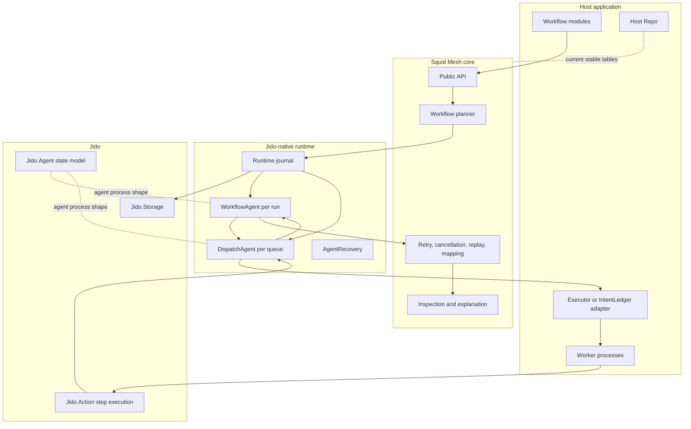
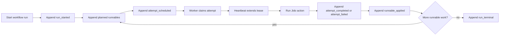
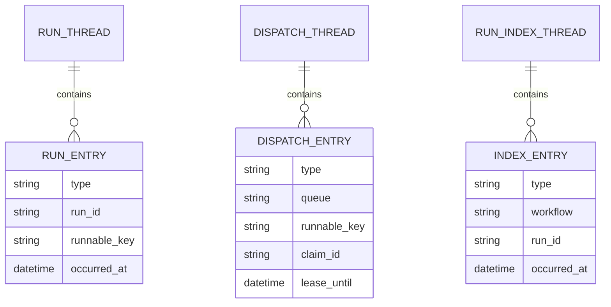
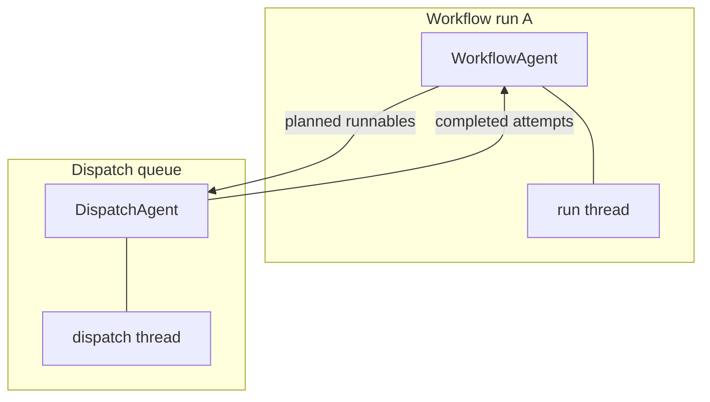
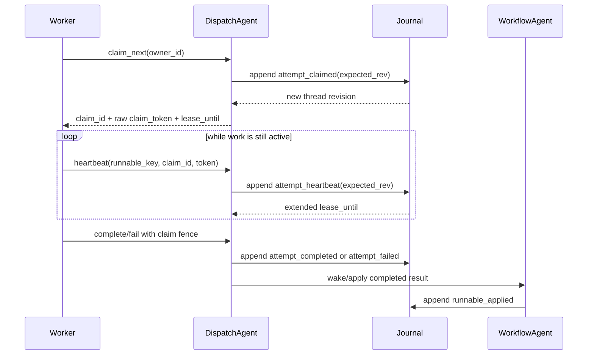
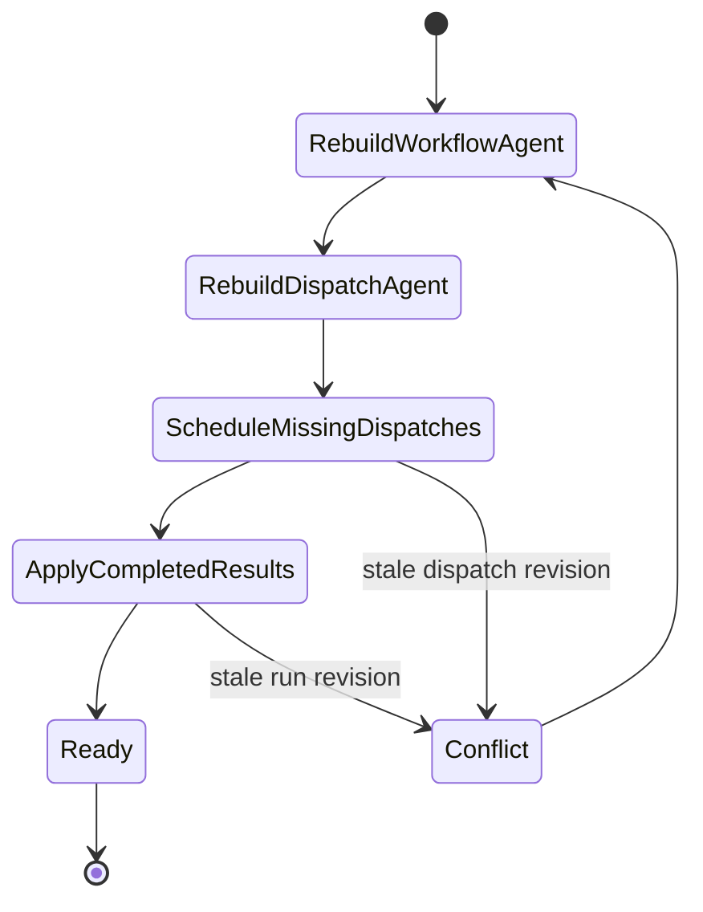
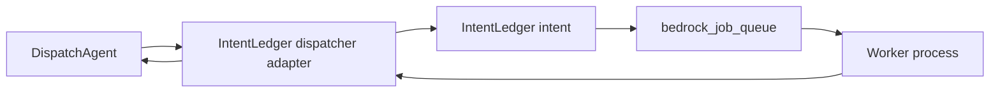
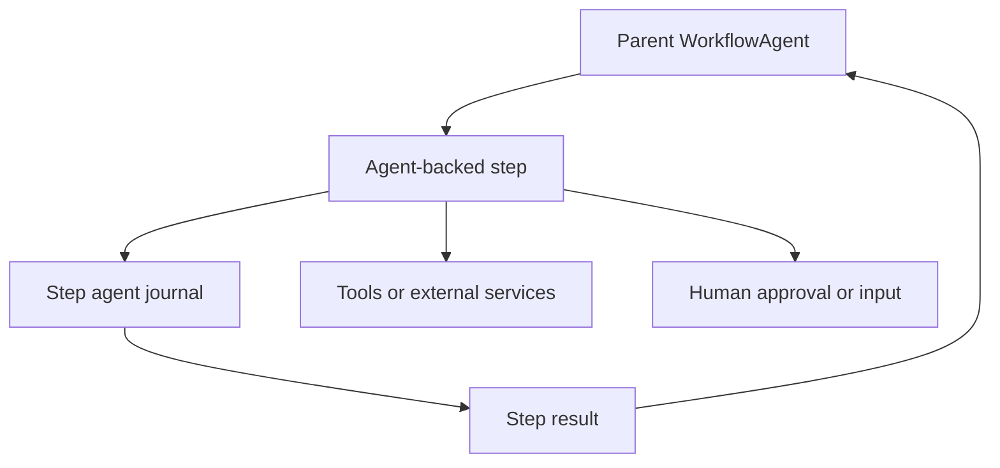

# Jido Runtime Architecture

This document describes the intended Squid Mesh runtime shape as the project
continues moving onto Jido-native coordination. It is written for new
contributors and host-app maintainers who need to understand how the pieces fit
together before reading individual modules.

Squid Mesh's direction is:

- workflow authors keep using the Squid Mesh DSL for business workflows
- custom step modules run through Jido action contracts
- runtime coordination rebuilds from Jido-backed journals
- workflow runs and dispatch queues are represented by Jido agents
- durable executor integration can default to IntentLedger while staying
  replaceable at the dispatch boundary

The live runtime still includes the current Postgres tables and host-provided
`SquidMesh.Executor` path. The Jido-native modules described here are the
target architecture and are being introduced in small slices.

## Roadmap Alignment

The final intended shape is anchored in the public issue roadmap:

| Issue | Status | Architecture impact |
| --- | --- | --- |
| [#160](https://github.com/ccarvalho-eng/squid_mesh/issues/160) | Open umbrella | Rebuild the core around Jido primitives, Runic planning, Spark workflow specs, and journal-backed runtime state |
| [#161](https://github.com/ccarvalho-eng/squid_mesh/issues/161) | Closed | Defines the durable dispatch protocol over Jido thread journals |
| [#162](https://github.com/ccarvalho-eng/squid_mesh/issues/162) | Closed | Adds the `Jido.Storage` journal and checkpoint boundary |
| [#164](https://github.com/ccarvalho-eng/squid_mesh/issues/164) | Closed | Adds rebuildable workflow and dispatch agents |
| [#165](https://github.com/ccarvalho-eng/squid_mesh/issues/165) | Closed | Compiles Spark workflow specs into Runic planner state |
| [#170](https://github.com/ccarvalho-eng/squid_mesh/issues/170) | Open | Adds IntentLedger-backed leases, heartbeats, and fencing for running attempts |
| [#163](https://github.com/ccarvalho-eng/squid_mesh/issues/163) | Open | Rebuilds inspection and explanation as projections over journals and checkpoints |
| [#140](https://github.com/ccarvalho-eng/squid_mesh/issues/140) | Open | Adds conditional and deferred continuation through durable planner facts |
| [#141](https://github.com/ccarvalho-eng/squid_mesh/issues/141) | Open | Adds dynamic graph expansion after the static Jido-native core is proven |
| [#109](https://github.com/ccarvalho-eng/squid_mesh/issues/109) | Open | Adds reference workflows that demonstrate the target product surface |

The ground rule from #160 still applies: the first core should prove a small,
trustworthy static workflow runtime. Dynamic graph expansion, richer agent-step
execution, and advanced reference workflows come after the journaled core is
stable.

## Layer Map



The key design point is that the journal, not a worker process, becomes the
authority for workflow intent and dispatch lifecycle. Processes are allowed to
crash and restart because their projections can be rebuilt from durable facts.

## Component Responsibilities

| Component | Owns | Does not own |
| --- | --- | --- |
| Workflow DSL | Business triggers, payload contracts, step graph, retry declarations | Queue leases, worker lifecycle, storage adapter details |
| Squid Mesh core | Validation, planning, replay/cancellation semantics, inspection model | Host scheduling infrastructure or external side-effect idempotency |
| Runtime journal | Append-only facts, thread revisions, checkpoints through `Jido.Storage` | Business decisions hidden outside entries |
| `WorkflowAgent` | Per-run coordination projection, planned runnables, applied results, terminal state | Executing step code directly |
| `DispatchAgent` | Queue projection, visible attempts, claims, leases, heartbeats, completions, failures | Choosing the workflow graph |
| Executor adapter | Waking workers and integrating a delivery backend such as IntentLedger | Rewriting Squid Mesh workflow semantics |
| Jido actions | Step callback contract and action execution boundary | Whole-workflow orchestration |
| Host app | Domain code, repo, deployment, external APIs, permissions | Squid Mesh runtime invariants |

## Runtime Shape



The target runtime uses two different kinds of durable state:

- journal entries: the source of truth for lifecycle facts
- checkpoints: cached projections that speed up rebuilds

Checkpoints are always disposable. If a checkpoint is missing or stale, the
agent can replay entries from the thread and reconstruct the same projection.

## Journal Threads



| Thread | Example Jido thread id | Purpose |
| --- | --- | --- |
| Run thread | `squid_mesh:run:<run-id>` | Workflow lifecycle facts for one run |
| Dispatch thread | `squid_mesh:dispatch:<queue>` | Queue-visible attempts, claims, heartbeats, retries, completions, and failures |
| Run index thread | `squid_mesh:run_index:<workflow>` | Rebuildable lookup facts for host-facing run discovery |

Each append uses the current thread revision as an optimistic fence. A stale
caller that tries to append based on an old projection receives a conflict
instead of silently overwriting runtime state.

## Agents

Squid Mesh uses Jido agents as rebuildable runtime coordinators, not as a new
business workflow authoring surface.



| Agent | Cardinality | Rebuilds from | Main questions it answers |
| --- | --- | --- | --- |
| `WorkflowAgent` | One per workflow run | Run thread and checkpoint | What is planned, applied, waiting, terminal, or recoverable for this run? |
| `DispatchAgent` | One per queue | Dispatch thread and checkpoint | Which attempts are visible, claimed, expired, completed, failed, or retryable? |
| Future step agent | Optional, per long-running step or sub-agent | A step-owned thread or parent run thread | What state belongs inside one long-running autonomous step? |

The phrase "a workflow is an agent" is directionally correct for the target
runtime, with one important nuance: the workflow run is coordinated by a
`WorkflowAgent`. The workflow definition remains declarative data, and each
step remains a business action or built-in step.

## Heartbeats And Leases

Heartbeats belong to dispatch claims. They are not a second workflow state
machine and they do not make external side effects exactly-once.



Heartbeat rules:

| Rule | Reason |
| --- | --- |
| A heartbeat must include the current `claim_id` and raw claim token | Prevents an old worker from extending a replacement worker's lease |
| The journal stores only `claim_token_hash` | Keeps the durable audit trail useful without storing bearer tokens |
| Heartbeats extend `lease_until` only before the current lease expires | Makes expired work recoverable without active takeover |
| Completion and failure use the same claim fence | Prevents stale workers from reporting final results after losing the lease |
| Expired claims remain visible to projection rebuilds | Allows recovery after worker death or node restart |

For long-running steps, this heartbeat path is the missing durability piece
tracked by #170. It lets the runtime distinguish "still alive" from "needs
recovery". The durable executor adapter should own the concrete lease mechanics
once IntentLedger is plugged in, with Squid Mesh translating the resulting
lifecycle facts into its dispatch projection.

## Recovery Flow



`SquidMesh.Runtime.AgentRecovery` drains two restart-safe windows in order:

1. Planned-but-unscheduled runnables are written to the dispatch thread.
2. Completed-but-unapplied dispatch results are written back to the run thread.

This ordering matters. A restarted node should first make all durable workflow
intent visible to dispatch before applying finished work back to the workflow
projection.

## Failure Handling Matrix

| Failure | Durable evidence | Recovery behavior |
| --- | --- | --- |
| Crash after planning but before scheduling dispatch | Run thread has planned runnable; dispatch thread lacks attempt | `WorkflowAgent.schedule_pending_dispatches/4` appends missing attempts |
| Worker dies mid-step | Dispatch thread has claimed attempt; heartbeat stops and lease expires | Attempt becomes claimable again after expiry |
| Duplicate worker delivery | Dispatch projection already has active or terminal attempt state | Duplicate claim or completion is rejected, ignored, or reported as anomaly |
| Completion wakeup is lost | Dispatch thread has completed attempt; run thread lacks `runnable_applied` | `WorkflowAgent.apply_pending_results/4` appends the missing application |
| Run reaches terminal state while dispatch work exists | Run thread has `run_terminal` | Rebuilt dispatch views exclude terminal-run attempts from redelivery |
| Stale projection writes | Append uses old thread revision | `Jido.Storage` returns conflict; caller rebuilds |

## Where IntentLedger Fits

IntentLedger is expected to be the preferred durable executor integration after
the core Jido-native protocol is proven. It is not the place where Squid Mesh
workflow semantics move.



| Squid Mesh concept | IntentLedger-facing concept |
| --- | --- |
| Runnable intent | Intent |
| `runnable_key` | Intent key or lineage |
| Claim and heartbeat | Executor lease lifecycle |
| Completion or failure | Intent result translated back to dispatch facts |
| Retry visibility | Durable rescheduling of the intent |

This keeps setup friction low for most users while preserving an escape hatch:
advanced host applications can still implement a custom executor adapter if
they need a different backend. That adapter boundary should come after the core
protocol is trustworthy, matching the sequencing in #160 and #170.

## AI-Backed Steps

In the target runtime, the workflow run is already coordinated by a
`WorkflowAgent`. That means Squid Mesh does not need a separate step kind just
because a step implementation uses an LLM, calls tools, or delegates some local
decision-making to Jido.

AI-backed work should usually be modeled as an ordinary step:

```elixir
step :triage_ticket, MyApp.Steps.TriageTicket,
  input: [:ticket],
  output: :triage,
  retry: [max_attempts: 2]
```

That keeps the important contract visible:

- the workflow owns lifecycle, retries, replay, cancellation, and audit history
- the step owns its input/output contract and side-effect safety
- model calls and tool calls stay inside the step boundary
- inspection can explain the workflow without inventing a second workflow
  primitive

The closed `agent_step/3` issue
[#138](https://github.com/ccarvalho-eng/squid_mesh/issues/138) explored an
explicit metadata marker for agentic steps. With the workflow run itself moving
to a Jido-agent coordinator, that separate DSL construct is not currently part
of the core runtime roadmap.

A new construct would only be worth adding later if it has different lifecycle
semantics from a normal step. Examples might include a child journal, independent
checkpointing, or a bounded sub-agent whose internal state must survive
pause/resume, retry, replay, and deploys.

That possible shape would look like this:



Design questions before adding such a construct:

| Question | Direction |
| --- | --- |
| Does this need a child journal, or is a normal step enough? | Prefer a normal step unless separate durable state is required |
| How much child state should appear in `SquidMesh.explain_run/2`? | Surface high-signal checkpoints and links, not every internal token |
| How are permissions applied inside child work? | Host app policy should remain the trust boundary |
| Can child work be replayed safely? | Require explicit replay contracts and side-effect idempotency |
| Can child work outlive its parent run? | Default no; terminal parent runs should fence child work |

## Current Versus Target

| Area | Current stable path | Intended Jido-native path |
| --- | --- | --- |
| Workflow authoring | Squid Mesh DSL | Same DSL |
| Step execution | `SquidMesh.Step` and `Jido.Action` interop | Same, with stronger Jido-native contracts |
| Durable run state | Postgres run, step, attempt tables | Jido-backed run threads plus projections |
| Dispatch | Host-provided `SquidMesh.Executor` | Dispatch agent plus default IntentLedger adapter |
| Long-running recovery | Host executor redelivery and stale-step timeout | Lease heartbeat, expired claim recovery, journal rebuild |
| Inspection | Tables, audit events, explanation model | Projection-backed snapshots, explanation views, richer agent history |
| Storage | Host Repo and current migrations | `Jido.Storage` adapters, likely Postgres and Bedrock options |

## Later Runtime Features

These are intentionally not first-slice requirements. The first
projection-backed inspection snapshot already rebuilds workflow and dispatch
agent projections into a read-only view of pending dispatches, unapplied
results, visible attempts, expired claims, terminal state, and projection
anomalies. The first projected explanation layer derives deterministic
reason-specific details and next actions from that snapshot. The public
`SquidMesh.inspect_run/2` and `SquidMesh.explain_run/2` APIs now expose this
read model behind the explicit `read_model: :journal_projection` option with
`journal_storage:`, while the stable runtime-table read model remains the
default. Callers that opt into projection reads pass both options together, for
example
`SquidMesh.inspect_run(run_id, read_model: :journal_projection, journal_storage: storage)`.

| Feature | Issue | Runtime dependency |
| --- | --- | --- |
| Projection-backed inspection and explanation completion | [#163](https://github.com/ccarvalho-eng/squid_mesh/issues/163) | Stable snapshot shape, run-index projections, and complete coverage for paused, retrying, cancelled, failed, and ambiguous attempt states |
| Conditional paths and deferred continuation | [#140](https://github.com/ccarvalho-eng/squid_mesh/issues/140) | Durable planner facts and wakeup metadata |
| Dynamic graph expansion | [#141](https://github.com/ccarvalho-eng/squid_mesh/issues/141) | Proven static Runic planning, stable identifiers, inspectable origin metadata |
| Advanced reference workflows | [#109](https://github.com/ccarvalho-eng/squid_mesh/issues/109) | Implemented target features only, without Oban-specific assumptions |
| Child-agent step lifecycle | No active core issue | Only relevant if normal steps are insufficient because child journal semantics are required |

## Reading Order

After this overview, read:

1. [Architecture](architecture.md) for the current component list.
2. [Durable dispatch protocol](durable_dispatch_protocol.md) for exact journal
   entry semantics.
3. [Operations guide](operations.md) for current production boundaries.
4. [Workflow authoring](workflow_authoring.md) for the DSL that should remain
   stable through the runtime transition.
