# Jido Runtime Architecture

This document describes the Squid Mesh runtime shape after the switchover to
Jido-native coordination. It is written for new contributors and host-app
maintainers who need to understand how the pieces fit together before reading
individual modules.

Squid Mesh's runtime shape is:

- workflow authors keep using the Squid Mesh DSL for business workflows
- custom step modules run through Jido action contracts
- runtime coordination rebuilds from Jido-backed journals
- workflow runs and dispatch queues are represented by Jido agents
- step execution is pulled through `SquidMesh.execute_next/1`
- optional cron payload delivery remains backend-neutral through
  `SquidMesh.Runtime.Runner.perform/2`

If you only read three diagrams in this file, read the system overview, runtime
shape, and inspection flow. The tables below are reference material for
concrete boundaries.

## Roadmap Alignment

The current shape is anchored in the public issue roadmap:

| Issue | Status | Architecture impact |
| --- | --- | --- |
| [#160](https://github.com/dark-trench/squid_mesh/issues/160) | Closed umbrella | Rebuild the core around Jido primitives, Runic planning, Spark workflow specs, and journal-backed runtime state |
| [#161](https://github.com/dark-trench/squid_mesh/issues/161) | Closed | Defines the durable dispatch protocol over Jido thread journals |
| [#162](https://github.com/dark-trench/squid_mesh/issues/162) | Closed | Adds the `Jido.Storage` journal and checkpoint boundary |
| [#164](https://github.com/dark-trench/squid_mesh/issues/164) | Closed | Adds rebuildable workflow and dispatch agents |
| [#165](https://github.com/dark-trench/squid_mesh/issues/165) | Closed | Compiles Spark workflow specs into Runic planner state |
| [#170](https://github.com/dark-trench/squid_mesh/issues/170) | Closed | Adds backend-owned leases, heartbeats, and fencing for running attempts |
| [#163](https://github.com/dark-trench/squid_mesh/issues/163) | Closed | Rebuilds inspection and explanation as projections over journals and checkpoints |
| [#140](https://github.com/dark-trench/squid_mesh/issues/140) | Closed | Adds conditional and deferred continuation through durable planner facts |
| [#141](https://github.com/dark-trench/squid_mesh/issues/141) | Open | Adds native child workflow starts with durable parent lineage and idempotent child identity |
| [#109](https://github.com/dark-trench/squid_mesh/issues/109) | Open | Adds reference workflows that demonstrate the target product surface |

The ground rule from #160 still applies: the core should keep workflow state in
the journal and keep backend-specific delivery behind host boundaries. Dynamic
child runs now use that rule by recording parent lineage as durable facts and
starting each child as a normal journal run. Runtime-authored workflow specs,
richer agent-step execution, and advanced reference workflows remain separate
future work.

## System Overview

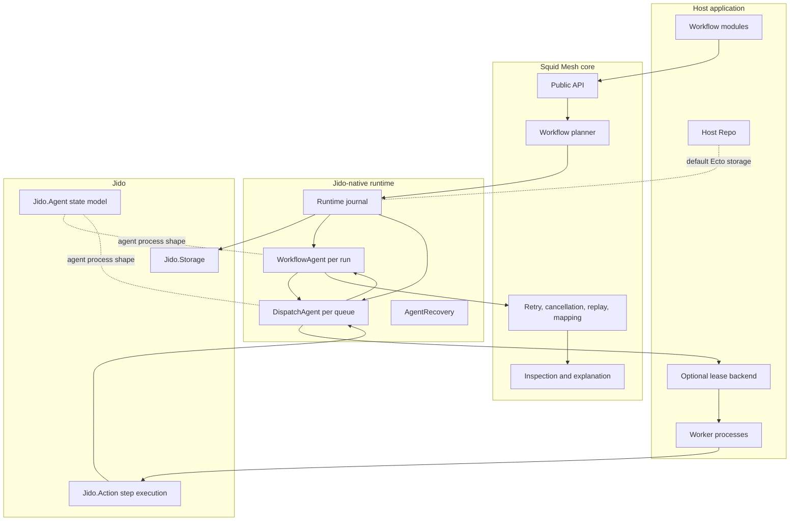

The key design point is that the journal, not a worker process, becomes the
authority for workflow intent and dispatch lifecycle. Processes are allowed to
crash and restart because their projections can be rebuilt from durable facts.

## Runtime Flow

| Component | Owns | Does not own |
| --- | --- | --- |
| Workflow DSL | Business triggers, payload contracts, step graph, retry declarations | Queue leases, worker lifecycle, storage adapter details |
| Squid Mesh core | Validation, planning, replay/cancellation semantics, inspection model | Host scheduling infrastructure or external side-effect idempotency |
| Runtime journal | Append-only facts, thread revisions, checkpoints through `Jido.Storage` | Business decisions hidden outside entries |
| `WorkflowAgent` | Per-run coordination projection, planned runnables, applied results, manual state, terminal state | Executing step code directly |
| `DispatchAgent` | Queue projection, visible attempts, claims, leases, heartbeats, completions, failures | Choosing the workflow graph |
| Optional lease backend | Waking workers and integrating durable delivery, claim, heartbeat, retry, and recovery mechanics | Rewriting Squid Mesh workflow semantics |
| Jido actions | Step callback contract and action execution boundary | Whole-workflow orchestration |
| Host app | Domain code, repo, deployment, external APIs, permissions | Squid Mesh runtime invariants |

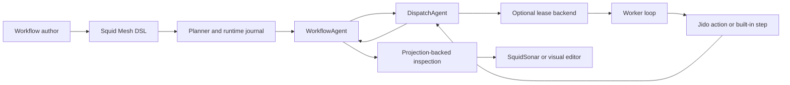

The runtime is intentionally asymmetric:

- authoring stays declarative
- durable facts stay in the journal
- execution stays in worker processes and Jido actions
- inspection stays read-only and projection-backed

## Runtime Command Signals

`SquidMesh.Runtime.Signal` is the Squid Mesh-native command envelope for
runtime requests. These structs sit above backend primitives:
`SquidMesh.Runtime.Signal.JidoAdapter` can translate them into `Jido.Signal`
envelopes at the boundary, but workflow authors and host apps should not need
to construct raw Jido signals for normal workflow control.

| Command type | Stable payload shape | Identity and idempotency |
| --- | --- | --- |
| `:start_run` | `%{workflow, trigger, input}` | optional caller-supplied idempotency key |
| `:start_cron` | `%{workflow, trigger, input}` | scheduler `signal_id` or complete `intended_window` derives the idempotency key |
| `:approve_run` | `%{run_id, attributes}` | `run_id` is a validated UUID |
| `:reject_run` | `%{run_id, attributes}` | `run_id` is a validated UUID |
| `:resume_run` | `%{run_id, attributes}` | `run_id` is a validated UUID |
| `:cancel_run` | `%{run_id}` | `run_id` is a validated UUID |
| `:replay_run` | `%{run_id, allow_irreversible}` | `run_id` is a validated UUID and irreversible replay stays explicit |

All command signals carry `metadata`, `occurred_at`, and an optional
`idempotency_key`. Runtime code should adapt these product-level signals at the
Jido boundary instead of leaking backend signal shapes into public APIs.

When a command reaches the journal runtime, Squid Mesh records a
`:run_signal_received` fact in the run thread before the command's lifecycle
facts. Starts, cron starts, manual approvals, rejections, resumes,
cancellations, and replays all use that audit shape. The fact stores the signal
type, run id when available, payload, actor, comment, metadata, idempotency key,
and occurrence time. Metadata is redacted for common sensitive keys before it is
persisted.

The command receipt and command application facts are appended together with one
thread revision fence. That keeps the journal as the source of truth and avoids a
crash window where inspection could see a command receipt without the matching
workflow-state change. Duplicate commands keep their existing semantics: cron
duplicates and already-applied manual resolutions return the existing run state
without appending another receipt.

Inspection exposes the projected command receipts through
`Snapshot.command_history`, ordered by receipt time. This is the lightweight
operator-facing command audit surface; `include_history: true` still controls
the detailed step and manual audit events.

The Jido adapter uses CloudEvents-compatible envelopes with source
`/squid_mesh/runtime/commands`, type names such as
`squid_mesh.runtime.command.start_run`, and content type
`application/vnd.squid-mesh.runtime-signal+json`. The envelope `data` holds the
Squid Mesh command type, payload, metadata, occurrence timestamp, and
idempotency key. `from_jido/1` accepts only the known Squid Mesh source and
command types, and maps serialized string command names through an explicit
whitelist rather than creating atoms from input.

## Runtime Capability Matrix

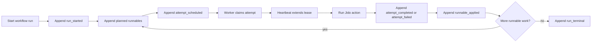

The journal-backed runtime uses two different kinds of durable state:

- journal entries: the source of truth for lifecycle facts
- checkpoints: cached projections that speed up rebuilds

Checkpoints are always disposable. If a checkpoint is missing or stale, the
agent can replay entries from the thread and reconstruct the same projection.

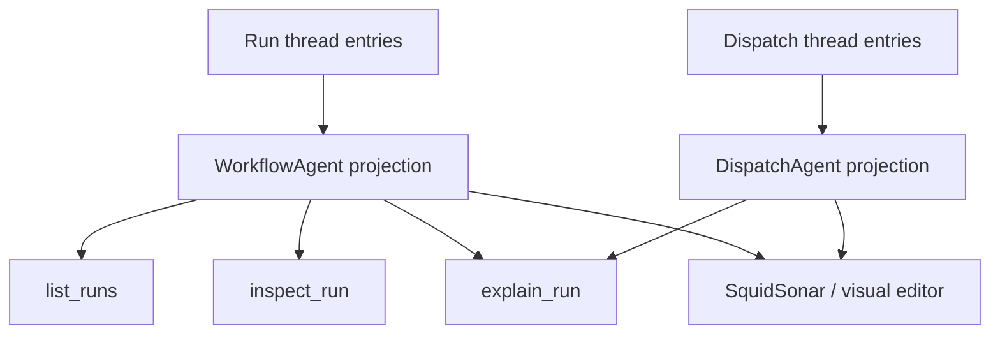

This is the contract visual tooling should target. The editor reads from
projections, not from worker processes or live queue internals.

## Execution Ordering

The runtime is careful about which durable fact is written before the next
effect becomes visible. The ordering below is the core safety model for normal
step execution, retry, and successor dispatch.

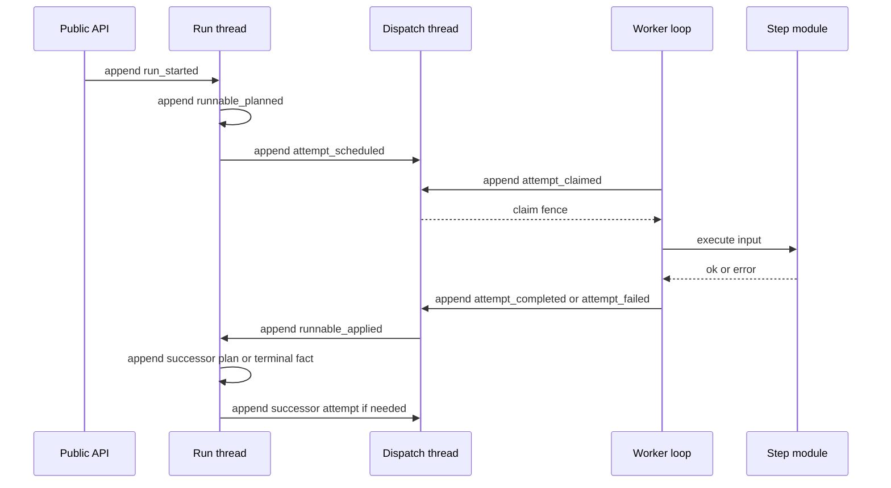

The worker never becomes the authority for workflow progress. It only holds a
claim fence long enough to execute a visible attempt and report the result.

## Journal Threads

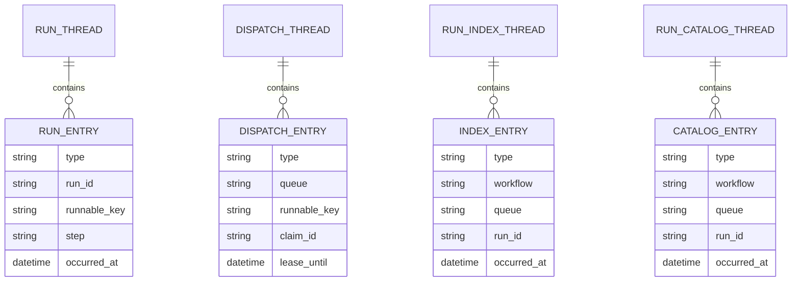

| Thread | Example Jido thread id | Purpose |
| --- | --- | --- |
| Run thread | `squid_mesh:run:<run-id>` | Workflow lifecycle facts for one run |
| Dispatch thread | `squid_mesh:dispatch:<queue>` | Queue-visible attempts, claims, heartbeats, retries, completions, and failures |
| Run index thread | `squid_mesh:run_index:<workflow>` | Rebuildable lookup facts for host-facing run discovery |
| Run catalog thread | `squid_mesh:run_catalog:all` | Global lookup facts for all-run discovery |

Each append uses the current thread revision as an optimistic fence. A stale
caller that tries to append based on an old projection receives a conflict
instead of silently overwriting runtime state.

## Projection Rebuild Map

The read model is intentionally rebuildable from journal threads. Checkpoints
only shorten replay; deleting them must not change the resulting state.

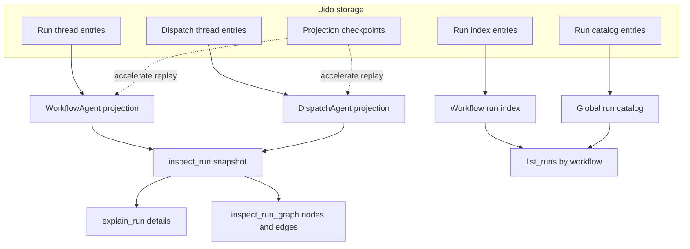

This is the boundary SquidSonar and visual editors should depend on: listing
comes from catalog or index projections, while run detail and graph views come
from inspection projections.

## Agents

Squid Mesh uses Jido agents as rebuildable runtime coordinators, not as a new
business workflow authoring surface.

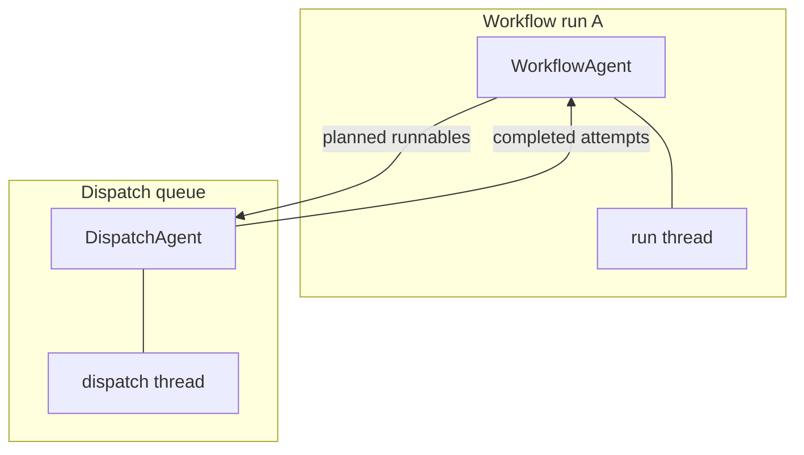

| Agent | Cardinality | Rebuilds from | Main questions it answers |
| --- | --- | --- | --- |
| `WorkflowAgent` | One per workflow run | Run thread and checkpoint | What is planned, applied, waiting, terminal, or recoverable for this run? |
| `DispatchAgent` | One per queue | Dispatch thread and checkpoint | Which attempts are visible, claimed, expired, completed, failed, or retryable? |
| Future step agent | Optional, per long-running step or sub-agent | A step-owned thread or parent run thread | What state belongs inside one long-running autonomous step? |

The phrase "a workflow run is coordinated by an agent" is useful with one
important nuance: the workflow definition remains declarative data, and each
step remains a business action or built-in step.

## Heartbeats And Leases

Heartbeats belong to dispatch claims. They are not a second workflow state
machine and they do not make external side effects exactly-once.

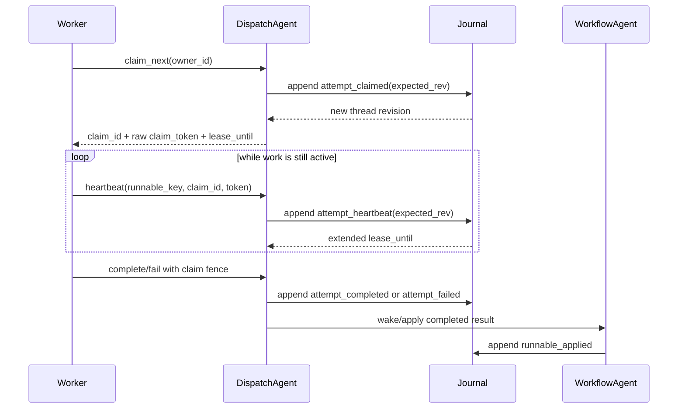

Heartbeat rules:

| Rule | Reason |
| --- | --- |
| A heartbeat must include the current `claim_id` and raw claim token | Prevents an old worker from extending a replacement worker's lease |
| The journal stores only `claim_token_hash` | Keeps the durable audit trail useful without storing bearer tokens |
| Heartbeats extend `lease_until` only before the current lease expires | Makes expired work recoverable without active takeover |
| Completion and failure use the same claim fence | Prevents stale workers from reporting final results after losing the lease |
| Expired claims remain visible to projection rebuilds | Allows recovery after worker death or node restart |

For long-running steps, this heartbeat path lets the runtime distinguish "still
alive" from "needs recovery". A lease-capable backend should own the concrete
lease mechanics when a host needs backend-owned worker fencing, with Squid Mesh
translating the resulting lifecycle facts into its dispatch projection.

## Recovery Flow

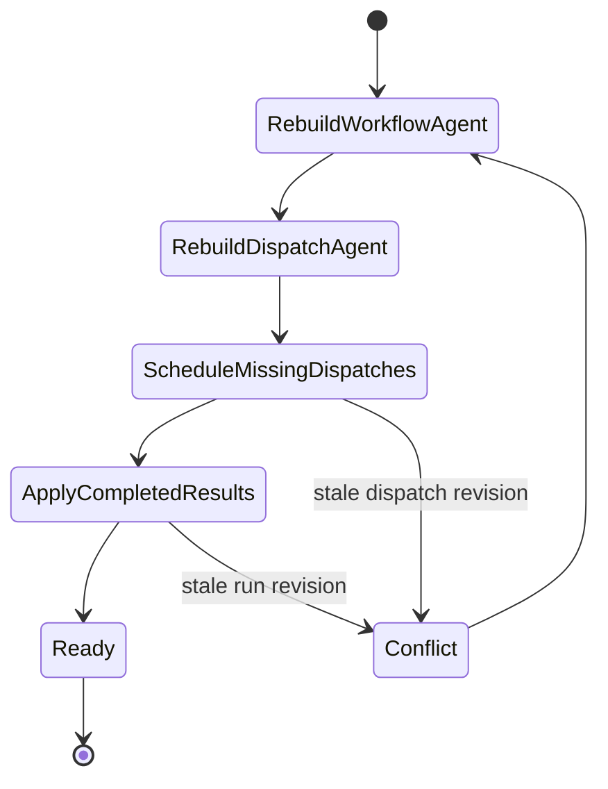

`SquidMesh.Runtime.AgentRecovery` drains two restart-safe windows in order:

1. Planned-but-unscheduled runnables are written to the dispatch thread.
2. Completed-but-unapplied dispatch results are written back to the run thread.

This ordering matters. A restarted node should first make all durable workflow
intent visible to dispatch before applying finished work back to the workflow
projection.

## Failure Handling Matrix

| Failure | Durable evidence | Recovery behavior |
| --- | --- | --- |
| Crash after planning but before scheduling dispatch | Run thread has planned runnable; dispatch thread lacks attempt | `WorkflowAgent.schedule_pending_dispatches/4` appends missing attempts |
| Worker dies mid-step | Dispatch thread has claimed attempt; heartbeat stops and lease expires | Attempt becomes claimable again after expiry |
| Duplicate worker delivery | Dispatch projection already has active or terminal attempt state | Duplicate claim or completion is rejected, ignored, or reported as anomaly |
| Completion wakeup is lost | Dispatch thread has completed attempt; run thread lacks `runnable_applied` | `WorkflowAgent.apply_pending_results/4` appends the missing application |
| Run reaches terminal state while dispatch work exists | Run thread has `run_terminal` | Rebuilt dispatch views exclude terminal-run attempts from redelivery |
| Stale projection writes | Append uses old thread revision | `Jido.Storage` returns conflict; caller rebuilds |

## Where Backend Leases Fit

Backend leases are optional runtime infrastructure. They are not the place
where Squid Mesh workflow semantics move.

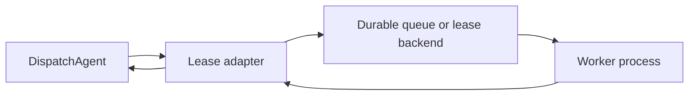

| Squid Mesh concept | Backend-facing concept |
| --- | --- |
| Runnable intent | Durable work item, job, or intent |
| `runnable_key` | Backend key, idempotency key, or lineage metadata |
| Claim and heartbeat | Backend lease lifecycle |
| Completion or failure | Intent result translated back to dispatch facts |
| Retry visibility | Durable rescheduling or delayed visibility |

This keeps setup friction low for most users while preserving an escape hatch:
basic hosts can use a simple `execute_next/1` worker loop, while advanced hosts
can connect a backend lease adapter when they need stronger distributed worker
ownership. Bedrock is the recommended reference backend today because the
example app exercises queueing, delayed visibility, claims, heartbeats,
completion, retry, and dead-letter behavior without coupling workflow modules
to Bedrock APIs.

## AI-Backed Steps

In the journal-backed runtime, the workflow run is coordinated by a `WorkflowAgent`.
That means Squid Mesh does not need a separate step kind just because a step
implementation uses an LLM, calls tools, or delegates some local decision-making
to Jido.

AI-backed work should usually be modeled as an ordinary step:

```elixir
step :triage_ticket, MyApp.Steps.TriageTicket,
  input: [:ticket],
  output: :triage,
  retry: [max_attempts: 2]
```

That keeps the important contract visible:

- the workflow owns lifecycle, retries, replay, cancellation, and audit history
- the step owns its input/output contract and side-effect safety
- model calls and tool calls stay inside the step boundary
- inspection can explain the workflow without inventing a second workflow
  primitive

The closed `agent_step/3` issue
[#138](https://github.com/dark-trench/squid_mesh/issues/138) explored an
explicit metadata marker for agentic steps. With the workflow run itself now
coordinated by a Jido agent, that separate DSL construct is not currently part
of the core runtime roadmap.

A new construct would only be worth adding later if it has different lifecycle
semantics from a normal step. Examples might include a child journal, independent
checkpointing, or a bounded sub-agent whose internal state must survive
pause/resume, retry, replay, and deploys.

That possible shape would look like this:

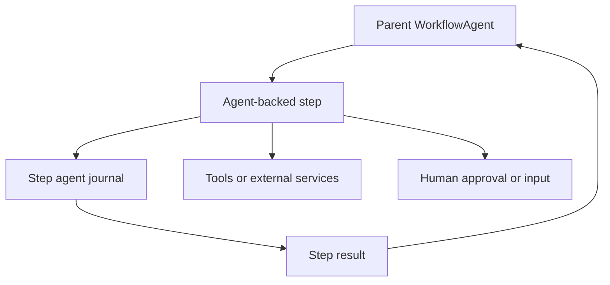

Design questions before adding such a construct:

| Question | Direction |
| --- | --- |
| Does this need a child journal, or is a normal step enough? | Prefer a normal step unless separate durable state is required |
| How much child state should appear in `SquidMesh.explain_run/2`? | Surface high-signal checkpoints and links, not every internal token |
| How are permissions applied inside child work? | Host app policy should remain the trust boundary |
| Can child work be replayed safely? | Require explicit replay contracts and side-effect idempotency |
| Can child work outlive its parent run? | Default no; terminal parent runs should fence child work |

## Runtime Shape

| Area | Current path | Notes |
| --- | --- | --- |
| Workflow authoring | Squid Mesh DSL | Workflow authors do not need to write Jido agents directly |
| Step execution | `SquidMesh.Step` and `Jido.Action` interop | Workers claim visible attempts with `SquidMesh.execute_next/1` |
| Durable run state | Jido-backed run threads plus projections | The default Ecto adapter stores threads, entries, and checkpoints in the host repo |
| Dispatch | Dispatch agent plus journal attempts | Backend-owned leases can be layered through `SquidMesh.Executor.Leases` |
| Long-running recovery | Lease heartbeat, expired claim recovery, journal rebuild | Timeout-based step reclaim is not part of the public config |
| Inspection | Projection-backed snapshots and explanations | Inspection rebuilds from journal facts |
| Storage | `Jido.Storage` adapters | Postgres-compatible Ecto storage is the default supported path |

## Runtime Feature Map

Projection-backed inspection rebuilds workflow and dispatch agent projections
into a read-only view of pending dispatches, unapplied results, scheduled
attempts, visible attempts, expired claims, manual pause or approval state,
terminal state, and projection anomalies. Run-index projections rebuild
workflow-scoped run lookup state from durable index entries, while the global
run-catalog projection rebuilds all-run lookup state without scanning adapter
internals. Both facts retain the queue each run was dispatched through and keep
malformed or conflicting facts visible as anomalies. The projected explanation
layer derives deterministic reason-specific details and next actions from the
inspection snapshot. The public `SquidMesh.inspect_run/2`,
`SquidMesh.list_runs/2`, and `SquidMesh.explain_run/2` APIs expose this read
model by default and infer Ecto storage from the configured repo. Host apps can
still pass explicit `journal_storage:` or `queue:` overrides when a test or
integration boundary needs a non-default journal boundary. Public start,
listing, execution, inspection, explanation, and manual-control APIs pick up
the configured defaults without repeating journal options at every call site.

The journal start path appends run, run-index, and run-catalog facts to
`Jido.Storage`, rebuilds the workflow and dispatch agents, schedules the initial
dispatch attempts from the journal, and returns the projection-backed inspection
snapshot. Journal execution currently supports normal action steps, immediate
built-in `:log` steps, built-in `:wait` steps in transition and dependency
workflows, and manual `:pause` or `:approval` boundaries. Manual boundaries
persist intervention state: `unblock_run/3` resumes `:pause` steps, while
`approve_run/3` and `reject_run/3` resolve `:approval` decisions through the
configured journal runtime.

| Feature | Issue | Runtime dependency |
| --- | --- | --- |
| Projection-backed inspection and explanation hardening | No active issue | Additional coverage for ambiguous attempt states and operator-facing edge cases |
| Conditional paths and deferred continuation | [#140](https://github.com/dark-trench/squid_mesh/issues/140) | Durable planner facts and wakeup metadata |
| Dynamic child runs | [#141](https://github.com/dark-trench/squid_mesh/issues/141) | Stable parent runnable keys, idempotent child keys, inspectable parent-child lineage |
| Advanced reference workflows | [#109](https://github.com/dark-trench/squid_mesh/issues/109) | Implemented target features only, without Oban-specific assumptions |
| Child-agent step lifecycle | No active core issue | Only relevant if normal steps are insufficient because child journal semantics are required |

## Reading Order

After this overview, read:

1. [Architecture](architecture.md) for the current component list.
2. [Durable dispatch protocol](durable_dispatch_protocol.md) for exact journal
   entry semantics.
3. [Operations guide](operations.md) for current production boundaries.
4. [Workflow authoring](workflow_authoring.md) for the DSL that remains stable
   while backend execution choices evolve.
