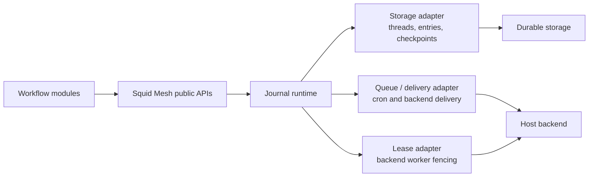

# Storage Strategy and Adapter Contract

Squid Mesh is storage-adapter agnostic at the journal runtime boundary. That
does not mean every database is automatically a correct runtime store. A storage
backend is portable only when its adapter provides the durability and ordering
semantics the runtime depends on.

The bundled production relational path is
`SquidMesh.Runtime.Journal.Storage.Ecto` with a Postgres-compatible Ecto repo.
When `journal_storage` is omitted, Squid Mesh infers:

```elixir
{SquidMesh.Runtime.Journal.Storage.Ecto, repo: MyApp.Repo}
```

That adapter persists Jido journal threads, entries, and checkpoints in the
host application's database through Squid Mesh's installed migrations. It keeps
workflow history, dispatch state, checkpoints, and host data inside the same
database boundary while still leaving the runtime behind an adapter-shaped
contract.

## Boundary

Workflow authors should not depend on storage APIs. Workflows declare triggers,
payloads, steps, transitions, retries, waits, and manual controls. Host code
starts runs, inspects runs, and provides workers through public Squid Mesh APIs.

Storage adapters are for the runtime boundary:

- `SquidMesh.Runtime.Journal.Storage` normalizes trusted host configuration.
- The configured adapter implements the Jido storage callbacks Squid Mesh uses
  for journal threads and checkpoints.
- Runtime modules append durable facts and rebuild projections through that
  boundary.

Keep storage adapters separate from executor, queue, and lease adapters. A
queue adapter can own delivery mechanics. A lease adapter can own worker
fencing against a backend. A storage adapter owns journal entries and
checkpoints. One backend may provide more than one adapter, but the contracts
stay separate.



## Required Adapter Guarantees

| Guarantee | Required behavior | Why it matters |
| --- | --- | --- |
| Ordered thread entries | `load_thread/2` must return each thread's entries in revision order with no gaps, duplicates, or reorderings. `append_thread/3` must assign stable, monotonic revisions to appended entries. | Workflow and dispatch projections rebuild from append-only facts. Reordering changes runtime meaning. |
| Optimistic conflict detection | `append_thread/3` must honor `:expected_rev` or an equivalent compare-and-append guard, returning a conflict error without appending when the caller's revision is stale. | Duplicate workers, stale projections, and concurrent commands must not both mutate the same runtime state. |
| Durable checkpoints | `put_checkpoint/3`, `get_checkpoint/2`, and `delete_checkpoint/2` must persist checkpoint data durably. Checkpoint payloads include last-applied thread revision pointers and projection state. | Checkpoints speed rebuilds but must never become a second source of truth. |
| Safe projection rebuilds | Missing, stale, deleted, or invalid checkpoints must allow the runtime to replay journal entries from the thread and recover the same projection. | Deploys, rebuilds, and checkpoint loss must not corrupt run state. |
| Clear error behavior | Missing threads and checkpoints must surface as not-found results. Stale appends must surface as conflict results. Infrastructure or serialization failures must surface as adapter errors rather than being swallowed. | Public APIs and recovery code need predictable failure paths. |
| Scoped deletion for tests and tooling | `delete_thread/2` and `delete_checkpoint/2` must delete only the requested thread or checkpoint key. Production runtimes should not rely on broad storage scans for normal operation. | Tests need cleanup, while runtime read models use durable catalog and index facts instead of adapter-specific scans. |
| Trusted configuration | Adapter options must come from host configuration, not request input. Secrets, connection options, and backend credentials must not be exposed through inspection or graph payloads. | Storage config is a trust boundary. |
| Stable serialization | Persisted entries and checkpoints must round-trip without executing untrusted code or depending on process-local state. | Runtime state must survive deploys, restarts, and projection rebuilds. |

## Current Ecto Path

The Ecto adapter is the recommended starting point for production hosts that
use Postgres or a Postgres-compatible Ecto adapter. It:

- stores journal threads in Squid Mesh's journal thread table
- stores normalized entries in the journal entry table
- stores checkpoints in the checkpoint table
- serializes appends through row-level locking
- honors Jido's `:expected_rev` option as optimistic conflict detection
- returns not-found, conflict, and adapter errors through the storage callback
  shapes used by the journal runtime

Postgres compatibility here is about the adapter's implementation needs, not a
promise that any SQL database will work unchanged. A non-Postgres relational
store needs an adapter that can provide equivalent per-thread ordering,
compare-and-append conflict detection, durable checkpoint reads, and predictable
transaction behavior.

## Non-Relational Stores

Non-relational durable stores can fit behind the same boundary when they
provide equivalent semantics. For example, an adapter could use a conditional
write, compare-and-swap revision, or single-key transaction to protect each
thread append.

The runtime does not require SQL specifically. It requires ordered append-only
facts, optimistic conflict detection, checkpoint persistence, and deterministic
rebuilds.

## Bedrock Direction

Bedrock is an optional backend direction, not a required storage dependency. A
future Bedrock-backed storage adapter should implement the same journal storage
contract described here. It should not make workflow modules depend on Bedrock,
and it should not merge storage concerns with Bedrock queue, delivery, lease,
heartbeat, retry requeue, or dead-letter adapters.

The current Bedrock example app demonstrates backend-owned delivery and lease
behavior while still using the configured Squid Mesh journal storage boundary
for workflow and attempt state. A future Bedrock storage adapter can become a
first-class option without changing workflow authoring or public runtime APIs.
